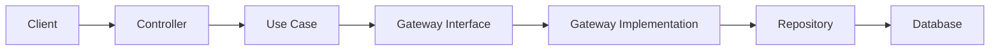

<div align="center">

# 🎯 Event API - Clean Architecture

</div>

<div align="center">

[](https://openjdk.java.net/projects/jdk/17/)
[](https://spring.io/projects/spring-boot)
[](https://www.postgresql.org/)
[](https://aws.amazon.com/ec2/)
[](https://www.docker.com/)

**Uma API RESTful robusta para gerenciamento de eventos, construída com Java 17 e Spring Boot, seguindo os princípios da Clean Architecture.**

[🚀 Deploy em Produção](#-deploy-aws-ec2) • [📚 Documentação](#-documentação-da-api) • [🏗️ Arquitetura](#-arquitetura) • [⚡ Quick Start](#-quick-start)

</div>

---

## 🌟 Características Principais

- 🏛️ **Clean Architecture** - Separação clara de responsabilidades entre camadas
- 🔒 **Type Safety** - Records do Java para entidades imutáveis
- 🎲 **Identificadores Únicos** - Sistema automático de geração de códigos de eventos
- 🐘 **PostgreSQL** - Banco de dados robusto com migrações Flyway
- 🐳 **Docker Ready** - Containerização completa com Docker Compose
- ☁️ **AWS Deployed** - Ambiente de produção no Amazon EC2
- 🧪 **Testável** - Arquitetura que facilita testes unitários e de integração

---

## 🏗️ Arquitetura

A aplicação segue os princípios da **Clean Architecture**, organizando o código em camadas concêntricas que garantem baixo acoplamento e alta coesão:

```
📦 Event API
├── 🎯 Core (Domain)
│   ├── entities/          # Entidades de negócio
│   ├── enums/            # Tipos de eventos
│   ├── gateway/          # Contratos de acesso a dados
│   └── usecases/         # Regras de negócio
└── 🔧 Infrastructure
    ├── beans/            # Configuração de dependências
    ├── controller/       # Endpoints REST
    ├── dto/             # Objetos de transferência
    ├── exceptions/      # Tratamento de erros
    ├── gateway/         # Implementação dos gateways
    ├── mapper/          # Conversão entre camadas
    └── persistence/     # Acesso ao banco de dados
```

### 📊 Fluxo de Dados



---

## ⚡ Quick Start

### 📋 Pré-requisitos

- ☕ **Java 17+** - [Download aqui](https://adoptium.net/)
- 🔧 **Maven 3.8+** - [Guia de instalação](https://maven.apache.org/install.html)
- 🐳 **Docker & Docker Compose** - [Get Docker](https://docs.docker.com/get-docker/)

### 🚀 Executando Localmente

1. **Clone o repositório**
```bash
git clone https://github.com/lucasaita1/event-api-clean-architecture.git
cd event-api-clean-architecture
```

2. **Inicie o banco de dados**
```bash
docker-compose up -d
```

3. **Execute a aplicação**
```bash
# Desenvolvimento com H2 (em memória)
mvn spring-boot:run

# Produção com PostgreSQL
mvn spring-boot:run -Dspring.profiles.active=prod
```

4. **Acesse a aplicação**
- 🌐 API: `http://localhost:8080`
- 🗄️ H2 Console: `http://localhost:8080/h2-console`

---

## 📚 Documentação da API

### 🎫 Endpoints Disponíveis

#### 📝 Criar Evento
```http
POST /api/v1/create
Content-Type: application/json

{
  "name": "Tech Conference 2025",
  "description": "Conferência de tecnologia e inovação",
  "dateStart": "2025-03-15T09:00:00",
  "dateFinish": "2025-03-15T18:00:00",
  "localEvent": "Centro de Convenções",
  "organization": "Tech Community",
  "capacity": "500",
  "type": "WORKSHOP"
}
```

#### 📋 Listar Eventos
```http
GET /api/v1/
```

#### 🔍 Buscar por Identificador
```http
GET /api/v1/{identificator}
```

### 🏷️ Tipos de Eventos Suportados

| Tipo | Descrição |
|------|-----------|
| `MUSICAL` | Eventos musicais e shows |
| `WORKSHOP` | Workshops e oficinas |
| `SPEAKER` | Palestras e apresentações |
| `SEMINAR` | Seminários acadêmicos |
| `THEATER` | Apresentações teatrais |
| `PRESENTIAL` | Eventos presenciais gerais |

---

## 🌐 Deploy AWS EC2

### ☁️ Ambiente de Produção

A aplicação está **deployada e funcionando** em uma instância EC2 da Amazon Web Services, proporcionando:

- 🔧 **Alta Disponibilidade** - Infraestrutura robusta da AWS
- 🚀 **Performance Otimizada** - Instâncias dimensionadas adequadamente
- 🔒 **Segurança** - VPC configurada com security groups
- 📊 **Monitoramento** - CloudWatch para métricas e logs
- 🔄 **Escalabilidade** - Preparado para auto-scaling quando necessário

### 🛠️ Stack de Deploy

```
🌐 Internet
    ↓
🔒 Application Load Balancer
    ↓
🖥️ EC2 Instance (Ubuntu)
    ├── 🐳 Docker Container (Event API)
    └── 🐘 PostgreSQL Database
```

---

## 🔧 Stack Tecnológica

### Backend Core
- **Java 17** - Linguagem principal com recursos modernos
- **Spring Boot 3.5.5** - Framework de aplicação
- **Spring Data JPA** - Persistência de dados
- **PostgreSQL 14** - Banco de dados principal
- **H2** - Banco em memória para testes

### DevOps & Tools
- **Flyway** - Controle de versão do banco
- **Docker** - Containerização
- **Maven** - Gerenciamento de dependências
- **Lombok** - Redução de boilerplate

### Testing & Quality
- **JUnit 5** - Framework de testes
- **Mockito** - Mocking para testes unitários
- **Clean Architecture** - Padrão arquitetural

---

## 🎯 Funcionalidades Implementadas

- ✅ **Criação de Eventos** - Com geração automática de identificadores únicos
- ✅ **Listagem de Eventos** - Recuperação de todos os eventos cadastrados
- ✅ **Busca por Identificador** - Localização específica de eventos
- ✅ **Validação de Dados** - Tratamento robusto de erros
- ✅ **Migrações de Banco** - Controle de versão com Flyway
- ✅ **Containerização** - Deploy simplificado com Docker
- ✅ **Clean Architecture** - Código maintível e testável

---

## 🚀 Próximos Passos

### Roadmap de Desenvolvimento

- [ ] 🔐 **Autenticação JWT** - Sistema de login e autorização
- [ ] 📧 **Notificações** - Email/SMS para participantes
- [ ] 🎟️ **Sistema de Inscrições** - Gestão de participantes
- [ ] 📈 **Dashboard Analytics** - Métricas e relatórios
- [ ] 🔍 **Busca Avançada** - Filtros por data, tipo, localização
- [ ] 📱 **API Mobile** - Endpoints otimizados para apps
- [ ] 🌐 **Multi-tenant** - Suporte a múltiplas organizações

---

## 📄 Licença

Este projeto está sob a licença MIT. Veja o arquivo [LICENSE](LICENSE) para mais detalhes.

---

## 🤝 Contribuições

Contribuições são sempre bem-vindas! Para contribuir:

1. 🍴 Faça um fork do projeto
2. 🌿 Crie uma branch para sua feature (`git checkout -b feature/AmazingFeature`)
3. 💾 Commit suas mudanças (`git commit -m 'Add some AmazingFeature'`)
4. 📤 Push para a branch (`git push origin feature/AmazingFeature`)
5. 🎯 Abra um Pull Request

---

## 👨‍💻 Desenvolvido por

**Lucas Aita** - [GitHub](https://github.com/lucasaita1)

⭐ Se este projeto te ajudou, considere dar uma estrela!

---

<div align="center">
  <sub>Construído com ❤️ usando Java e Spring Boot</sub>
</div>